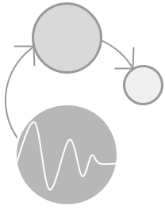

<p align="center">

</p>


<h1 align="center">$k$-Graph</h1>
<h2 align="center"> A Graph Embedding for Interpretable Time Series Clustering</h2>

<div align="center">
<p>
    
</p>
</div>

## $k$-Graph in short

$k$-Graph is an explainable and interpretable Graph-based time series clustering. $k$-Graph is divided into three steps: (i) Graph embedding, (ii) Graph clustering, and (iii) Consensus Clustering. In practice, it first projects the time series into a graph and repeats the operation for multiple pattern lengths. For each pattern length, we use the corresponding graph to cluster time series (based on nodes and edges frequency for each time series). We then find a consensus between all pattern lengths and use the consensus as clustering labels. Thanks to the graph representation of the time series (into a unique graph), $k$-Graph can be used for variable length time series. Moreover, we provide a way to select the most interpretable graph for the resulting clustering partition and allow the user to visualize the subsequences contained in the most represtnative and exclusive nodes.
An interactive tool to play with $k$-Graph can be found [here](https://github.com/boniolp/graphit/).

<p align="center">

</p>

## Contributors

- [Paul Boniol](https://boniolp.github.io/), Inria, ENS, PSL University, CNRS
- [Donato Tiano](https://liris.cnrs.fr/en/member-page/donato-tiano), Università degli Studi di Modena e Reggio Emilia
- [Angela Bonifati](https://perso.liris.cnrs.fr/angela.bonifati/), Lyon 1 University, IUF, Liris CNRS
- [Themis Palpanas](https://helios2.mi.parisdescartes.fr/~themisp/), Université Paris Cité, IUF


## Getting started

The easiest solution to install $k$-Graph is to run the following command:

```(bash) 
pip install kgraph-ts
```

Graphviz and pyGraphviz can be used to obtain better visualisation for $k$-Graph. These two packages are not necessary to run $k$-graph. If not installed, a random layout is used to plot the graphs.
To benefit from a better visualisation of the graphs, please install Graphviz and pyGraphviz as follows:

#### For Mac:

```(bash) 
brew install graphviz
```

#### For Linux (Ubuntu):

```(bash) 
sudo apt install graphviz
```

#### For Windows:

Stable Windows install packages are listed [here](https://graphviz.org/download/)

Once Graphviz is installed, you can install pygraphviz as follows:

```(bash) 
pip install pygraphviz
```


### Manual installation

You can also install manually $k$-Graph by following the instructions below.
All Python packages needed are listed in [requirements.txt](https://github.com/boniolp/kGraph/blob/main/requirements.txt) file and can be installed simply using the pip command: 

```(bash) 
conda env create --file environment.yml
conda activate kgraph
pip install -r requirements.txt
``` 
You can then install $k$-Graph locally with the following command:

```(bash) 
pip install .
``` 


## Usage

In order to play with $k$-Graph, please check the [UCR archive](https://www.cs.ucr.edu/%7Eeamonn/time_series_data_2018/). We depict below a code snippet demonstrating how to use $k$-Graph.

```python 
import sys
import pandas as pd
import numpy as np
import networkx as nx
import matplotlib.pyplot as plt
from sklearn.metrics import adjusted_rand_score

sys.path.insert(1, './utils/')
from utils import fetch_ucr_dataset

from kgraph import kGraph


path = "/Path/to/UCRArchive_2018/"
data = fetch_ucr_dataset('Trace',path)
X = np.concatenate([data['data_train'],data['data_test']],axis=0)
y = np.concatenate([data['target_train'],data['target_test']],axis=0)


# Executing kGraph
clf = kGraph(n_clusters=len(set(y)),n_lengths=10,n_jobs=4)
clf.fit(X)

print("ARI score: ",adjusted_rand_score(clf.labels_,y))
``` 
```
Running kGraph for the following length: [36, 72, 10, 45, 81, 18, 54, 90, 27, 63] 
Graphs computation done! (36.71151804924011 s) 
Consensus done! (0.03878021240234375 s) 
Ensemble clustering done! (0.0060100555419921875 s) 
ARI score:  0.986598879940902
```

For variable lenght time series datasets, $k$-Graph has to be initialized as follows:

```python
clf = kGraph(n_clusters=len(set(y)),variable_length=True,n_lengths=10,n_jobs=4)
``` 

### Visualization tools

We provide visualization methods to plot the graph and the identified clusters (i.e., graphoids). After running $k$-Graph, you can run the following code to plot the graphs partitioned in different clusters (grey are nodes that are not associated with a specific cluster).

```python
clf.show_graphoids(group=True,save_fig=True,namefile='Trace_kgraph')
``` 
<p align="center">

</p>

Instead of visualizing the graph, we can directly retrieve the most representative nodes for each cluster with the following code:

```python 
nb_patterns = 1

#Get the most representative nodes
nodes = clf.interprete(nb_patterns=nb_patterns)

plt.figure(figsize=(10,4*nb_patterns))
count = 0
for j in range(nb_patterns):
	for i,node in enumerate(nodes.keys()):

		# Get the time series for the corresponding node
		mean,sup,inf = clf.get_node_ts(X=X,node=nodes[node][j][0])
		
		count += 1
		plt.subplot(nb_patterns,len(nodes.keys()),count)
		plt.fill_between(x=list(range(int(clf.optimal_length))),y1=inf,y2=sup,alpha=0.2) 
		plt.plot(mean,color='black')
		plt.plot(inf,color='black',alpha=0.6,linestyle='--')
		plt.plot(sup,color='black',alpha=0.6,linestyle='--')
		plt.title('node {} for cluster {}: \n (representativity: {:.3f} \n exclusivity : {:.3f})'.format(nodes[node][j][0],node,nodes[node][j][3],nodes[node][j][2]))
plt.tight_layout()

plt.savefig('Trace_cluster_interpretation.jpg')
plt.close()
``` 
<p align="center">

</p>

You may find a script containing all the code above [here](https://github.com/boniolp/kGraph/blob/main/examples/scripts/Trace_example.py).


